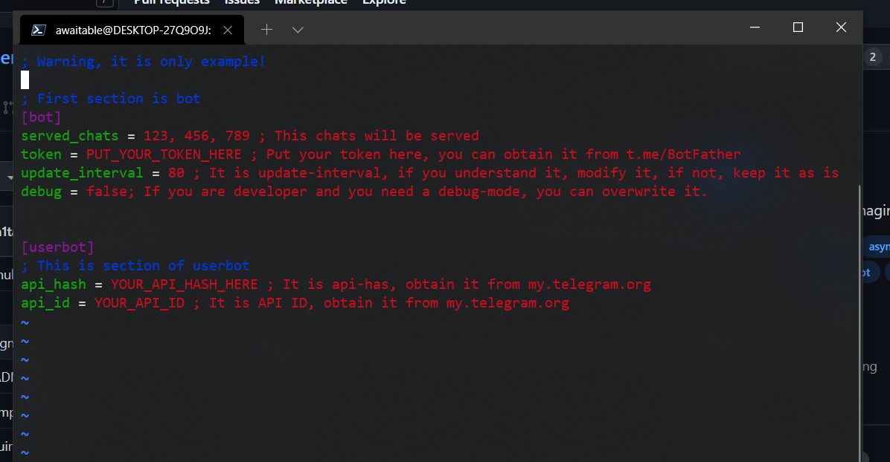

# 
IntelligentBot - bot for managing your telegram group.

  

## What I implemented and what I didn't implement
 - [x] - <b>Ban/Unban/Kick commands</b>
 - [X] - <b>Mute/Unmute commands</b>
 - [x] - <b>Simple captcha</b>
 - [X] - <b>Read-Only mode</b>
 - [x] - <b>Getting information about group</b>
 - [X] - <b>Using commands directly with user's username</b>
 - [X] - <b>Messages analyzing</b>
 - [ ] - <b>Announcements system</b>
 - [ ] - <b>Settings</b>
 - [ ] - <b>Localization system</b>

## How to run?
### Fill config
#### Rename a example_config.ini to whatever_you_want.ini
#### Than, open it.
 
#### Fill each field, I leaved some comments for help.
### Run bot
#### <code>python app --config whatever_you_want.ini</code>
#### For skipping updates, use <code>--skip-updates</code> key, (pass true as value)
 
## Built with
#### Aiogram - a powerfull framework to creating telegram bots (<a href='https://pypi.org/project/aiogram/'>Link</a>)
#### Pyrogram - a library for accesing telegram api. (<a href='https://github.com/pyrogram/pyrogram'>Link</a>)
#### Python - a great programming language.

### With ❤ Awaitable, 2021-2022
